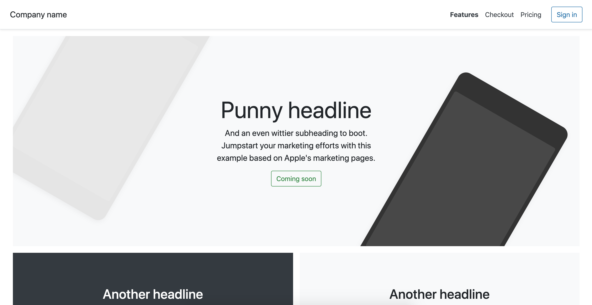

<h1 align="center">Bootstrap 4 for SpringType</h2>

> "How to use Bootstrap 4 with SpringType?"

SpringType comes with a lazy, fault-tolerant VDOM implementation that allows you to use standard HTML + CSS.
Unlike other modern frontend frameworks, SpringType *doesn't need any special wrapper component libraries*.

This means, you can just use the standard Bootstrap 4 SCSS/CSS, it's HTML and JS plugins like we did back in the good old days - but with components and VDOM :-)

<a href="https://springtype-org.github.io/st-bootstrap/" target="_blank">
  Live Demo
  
</a>

You can find a working integration example in the `playground` folder.

<h2 align="center">Scaffolding</h2>

For your convenience, we've created a scaffolding template for SpringType / Bootstrap 4 projects.
To use it, please install the SpringType scaffolding CLI `st-create`:

    yarn add global st-create

Then simply run:

    st-create -c project -t bootstrap-4 -n MyBootstrapProject

...and seconds later, a SpringType / Bootstrap 4 application will be created for you.

<h2 align="center">Manual integration guide</h2>

If you don't want to use `st-create`, the process of integrating Bootstrap 4 in a 
SpringType projects (or even any TypeScript project), is quite straigt forward.

You can choose to integrate third-party libraries via CDN or import them in JS 
to include them into the application JS bundle.

<h3 align="center">Importing third-party JS in application JS bundle</h2>

Install these dependencies:

    npm i st-bootstrap bootstrap jquery popper.js
OR:
    yarn add st-bootstrap bootstrap jquery popper.js

- jQuery is a Bootstrap 4 dependency
- Bootstrap 4 comes with the SCSS (SASS) stylesheets and the jQuery plugins for interactive components
- popper.js for 

Make sure to actually import these dependencies (e.g. in `src/index.tsx`):

```ts
// import jQuery, Bootstrap, popper.js
import { importBootstrap } from "st-boostrap";

st.run(async() => {

    // dynamically imports the dependencies jquery, bootstrap and popper.js
    await importBootstrap();

    // enabling SpringType support for Bootstrap 4 tooltip components 
    setupBootstrapComponent('tooltip');

    st.render(<YourAppIndex />);
});
```

<h3 align="center">Importing third-party JS using a CDN</h2>

The other option is to integrate Bootstrap 4 and it's dependencies in the `<head>` of your `index.html` just like described in the official Bootstrap 4 docs:

```html
  <script src="https://code.jquery.com/jquery-3.4.1.slim.min.js" integrity="sha384-J6qa4849blE2+poT4WnyKhv5vZF5SrPo0iEjwBvKU7imGFAV0wwj1yYfoRSJoZ+n" crossorigin="anonymous"></script>
  <script src="https://cdn.jsdelivr.net/npm/popper.js@1.16.0/dist/umd/popper.min.js" integrity="sha384-Q6E9RHvbIyZFJoft+2mJbHaEWldlvI9IOYy5n3zV9zzTtmI3UksdQRVvoxMfooAo" crossorigin="anonymous"></script>
  <script src="https://stackpath.bootstrapcdn.com/bootstrap/4.4.1/js/bootstrap.min.js" integrity="sha384-wfSDF2E50Y2D1uUdj0O3uMBJnjuUD4Ih7YwaYd1iqfktj0Uod8GCExl3Og8ifwB6" crossorigin="anonymous"></script>
```

Make sure *not* to import and call `importBootstrap()` then.

<h2 align="center">Bootstrap 4 JS Components</h2>

Some components require an initialization (e.g. tooltips). To do this, just implement the lifecycle method `onAfterInitialRender` just like described in the official Bootstrap 4 docs:

```ts
  onAfterInitialRender() {

    // tooltip integration
    $(() => {
        $('[data-toggle="tooltip"]', this.el).tooltip()
    });
  }
```

<h2 align="center">Custom theming using Sass</h2>

We also suggest, to create an SCSS file to integrate the Bootstrap 4 SCSS with custom themeing support.
Create a `theme.scss` in your `src` folder:

```scss
$theme-colors: (
    "primary": #1a6da9,
    "secondary": #2a863c,
);

@import "bootstrap/scss/bootstrap";
```

To transpile the SCSS file to CSS, just activate the SASS processing feature of `st-start` by creating or modfiying the file `st.config.js`. Add the key `staticStyleEntryPoints`:

```js
module.exports = {
    staticStyleEntryPoints: {
        'src/theme.scss': 'dist/theme.css'
    },
};
```

Finally, import the resulting `dist/theme.scss` CSS file in the `<head>` section of your `src/index.html` file:

```html
<head>

  <!-- added this for Font Awesome icon support -->
  <link rel="stylesheet" href="https://cdnjs.cloudflare.com/ajax/libs/font-awesome/5.11.2/css/all.min.css" />

  <!-- just using the most recent style globally -->
  <link href="../dist/theme.css" rel="stylesheet">

</head>
```

Most Bootstrap apps also use Font Awesome, so we recommend importing Font Awesome as well.

<h2 align="center">Maintainers</h2>

<table>
  <tbody>
    <tr>
      <td align="center">
        
        </br>
        <a href="https://github.com/kyr0">Aron Homberg</a>
      </td>
      <td align="center">
        
        </br>
        <a href="https://github.com/mansi1">Michael Mannseicher</a>
      </td>
    </tr>
  <tbody>
</table>

<h2 align="center">Contributing</h2>

Please help out to make this project even better and see your name added to the list of our  
[CONTRIBUTORS.md](./CONTRIBUTORS.md) :tada: